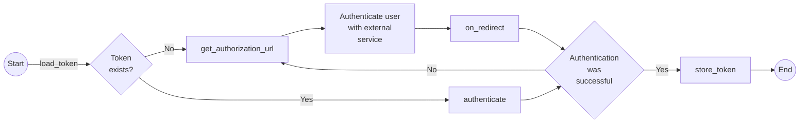

# Big Bot Developer Guide

This developer guide is intended to help build custom integrations using the Big Bot framework. Big
Bot supports following components for custom integrations.

* Chat Providers: Parse and process specific user queries, for example processing inputs like
  "what is two plus two?" or "how much is a kilogram in pounds?"
* Payment Provider: Process a payment request.
* OAuthProvider: Process a oauth request.
* Skill Provider: Implement complex bussines logic, for example searching and creating records in a
  external database.


## Big Bot Integration Structure

To start with Big Bot integration/app, you need to create these files:

```
.
└── manifest.json
├── component.py
├── init.py
```

Below is a functional description for these essential files.

##### manifest.json

This file holds meta information about your integration.

```json
{
  "name": "Google event",
  "version": 1.0,
  "maintainer" : "Jonathan Lee <jonathan@bigbot.ai>",
  "summary": "Big Bot Google Calendar",
  "description": "Google Calendar is a time-management and scheduling calendar service.",
  "category": "productivity",
  "author": "Jonathan Lee",
  "website": "https://bigbot.ai",
  "auto_install": true
}
```

##### component.py

Use this file to create your integration components. All of your components and business logic
should go here.

```python
from main.Component import ChatProvider, OAuthProvider, PaymentProvider, SkillProvider


class GoogleChatProvider(ChatProvider):
    # your chat provider
    pass


class GoogleOAuthProvider(OAuthProvider):
    # your oauth provider
    pass


class GooglePaymentProvider(PaymentProvider):
    # your payment provider
    pass


class GoogleSkillProvider(SkillProvider):
    # your skill provider logic
    pass
```

##### init.py

This module script helps you to register your integration components and any variables required for
the proper operation of your integration.

```python
from main.Config import AppConfig

from .component import GoogleChatProvider GoogleSkillProvider


class Application(AppConfig):

    def init(self, config):
        # Only override this function if you need read data from the config object
        self.registry()

    def registry(self):
        self.register(GoogleChatProvider)
        self.register(GoogleSkillProvider)
        self.register_variable(
            "com.company.google",             # Integration's identifier
            "GOOGLE_API_KEY",                 # Variable key
            "Google Cloud API Key",           # Variable description
        )
```

Two components has been registered in this snippet, GoogleSkillProvider and GoogleFAQ.

> Make sure the integration's directory and indentifier string is not shared with other
> integrations.

# Providers

## Integration Variables

If your integration requires specific settings per client, these can be set on the `registry` method
of your integration configuration:

```ptyhon
# init.py
from main.Config import AppConfig


class Application(AppConfig):
    def registry(self):
        self.register(MyWordpressComponent)
        self.register_variable(
            "com.company.wordpress",
            "WORDPRESS_API_KEY",
            "Wordpress REST API KEY",
        )
        self.register_variable(
            "com.company.wordpress",
            "WORDPRESS_SECRET_KEY",
            "Wordpress REST API secret"
            )
        self.register_variable(
            "com.company.wordpress",
            "WORDPRESS_FETCH_UNPUBLISHED",
            "If true the bot will also fetch unpublished posts",
        )
```

The variables can be used with any provider using the method `get_variable`:

```python
# component.py
from main.Component import SkillProvider


class MyWordpressComponent(SkillProvider):
    def on_execute(self, binder, user_id, package, data, *args, **kwargs):
        ...
        api_key = self.get_variable("com.company.wordpress", "WORDPRESS_API_KEY")
```

The `register_variable` method takes the following parameters:

+ `component` (`str`): You integration's identifier.
+ `key` (`str`): Variable's key.
+ `description` (`str`): Variable's description. Will be readable by the client.
+ `type`: Can be any of the following built-in python types: `bool`, `dict`, `float`, `int`, `list`,
  or `str`. Defaults to `str`.
+ `value`: Optional value, must be an instance of `type`.

The variables will be set by the client in the web interface of Big Bot.

## Integration static files

If you add a custom django template to your integration and the integration needs to read files form
the `static_files` directory, you need to append the path to the file to the variable `__static__`
instead of using the `static` tag.

```html
<html>
    <head>
        <link rel="stylesheet" href="{{__static__}}path/to/css/file" />
    </head>
    <body>
       ...
    </body>
</html>
```

**Note**: The `__static__` vairables ends with a slash (`/`).

## ChatProvider

A `ChatProvider` uses natural language processing (NPL) to process to specific user inputs, for
example "What time is it?" or "How much is two plus two?".

A subclass of `ChatProvider` must have the following methods:

### `can_process(binder: Binder, statement: InputStatement) -> bool`

Should return `True` if the provider can process the user input, `False` otherwise.

### `on_match_object(binder: Binder, statement: InputStatement) -> Tuple[float, object]`

Process the user input and returns a tuple of two elements:

+ `confidence`: A `float` between 0 and 1, represents the confidence in the `response_object`, where
  1 is a 100% confidence in the response.
+ `response_object`: Can be any type of object you want, if the response has the highest confidence
  the response_object will passed to the `process` method.

### `process(binder: Binder, statement: InputStatement, threshold: float, match_object: object)`

Does not return any value. Should send a message to the user, the `threshold` and `match_object`
parameters are the values returned by `on_match_object`

```python
from main.Component import ChatProvider
from main.Statement import OutputStatement

...

class MyChatProvider(ChatProvider):
    def process(self, binder, statement, threshold, match_object):
        # Do something with match_object
        ...
        output = OutputStatement(binder.operator_id)
        output.append_text("My custom response")
        binder.post_message(output)
```

## OAuthProvider

Process an OAuth request, an `OAuthProvider` must implement the following methods:

##### `authorization_url(redirect_uri, user_id) -> str`

Must return the service authorization URL. The returned URL must include all necesary data to
correctly process the OAuth request. The external service must redirect the user to redirect_uri
with the autorization token as part of the query string if the authentication was succesful. This
method must be overrided.

**Args**

+ `redirect_uri` (`str`): Server's redirect_uri.
+ `user_id` (`int`): User's id.

**Example**

```python
def authentication_url(self, redirect_url, user_id):
    api_key = self.get_variable("com.my.integration", "API_KEY")
    api_secret = self.get_variable("com.my.integration", "API_SECRET")
    return f"https://example.com/oauth/?api_key={api_key}&api_secret={api_secret}&redirect_uri={redirect_uri}"
```


##### `fetch_token(redirect_uri, authorization_response: ?)`

Must return the authorization token passed in authorization_response. This method must be overrided.

**Args**

+ `redirect_uri` (`str`): Server's redirect_uri.
+ `authorization_response` (`str`): Server's redirect_uri, but also includes the request state and
  authorization token.

**Example**

```python
def fetch_token(self, redirect_uri, authorization_response):
    from urllib.parse import parse_qsl, urlparse
    parsed_url = urlparse(authentication_response)
    query = dict(parse_qsl(parsed_url.query))
    return query["access_token"]
```

##### `is_authorized(user_id: int, token: str)`

Checks if the OAuth Object is valid.

##### `is_expired(user_id: int, token: str) -> bool`

Must check if an authorization token is still valid. This method must be overrided.

**Args**

+ `user_id` (`int`): User's id.
+ `token` (`str`): Token returned if fetch_token.

**Returns**

+ `bool`: True if token is still valid. False otherwise.

##### `refresh_token(user_id: int, token: str)`

Must refresh an authorization token. This method needs to be overrided

**Args**

+ `user_id` (`int`): User's id.
+ `token` (`str`): Token returned by fetch_token.

**Returns**

+ `str`: A refreshed token.

### Other functions

The `OAuthProvider` class also provider the following methods.

+ `authenticate(binder: Binder, user_id: int)`: Authenticates an existing oauth token. Returns an
  OAuth object if the authentication was succesful.
+ `build_oauth(token: str)`: Creates a new OAuth object.
+ `get_authorization_url(redirect_uri: str, user_id: int)`: Creates a custom auth url for the user.
  The URL adds a custom state to the result of  `authorization_url`. The state is appended to the
  querystring: `https://example.com/?state=<STATE>`.
+ `get_redirect_uri(binder: Binder)`: Returns server's redirect url.
+ `load_token(binder: Binder, user_id: int)`: Loads the token stored in the database.
+ `on_redirect(binder: Binder, authorization_response: ?)`: Authenticates a user on a redirect
  request. `authorization_response` is the full URL created by `get_authorization_url` plus the
  authentication token.
+ `save_token(binder: Binder, user_id: int, token: str)`: Stores the user token in the database.

### OAuth Object

An OAuth object can be any custom object that can interact with the API of your service provider
using the user token.

This object can be used by other integration classes, but must be initalized in a OAuthProvider
subclass.

### Workflow



The authentication workflow must follow this steps.

1. The block `InputOAuth` loads an stored OAuth token and authenticates the user. If the token
   exists and `build_oauth` token returns an object the `InputBlock` will be skipped. In this step
   the methods `load_token`.
2. If the authentication failed in teh last step the server will send a `OAuthNode` to the user.
   This step calls the functions `get_authorization_url` and `authentication_url`.
3. When the user gets redirected after authenticating with the external service, the method
   `on_redirect` will be called and extract the authentication token using the function
   `fetch_token`.
4. With the authentication completed the skill will continue to the next block.
5. If a `SkillProvider` must do a request to the external service an `OAuthProvider` instance will
   be initialized, during this step the method `built_oauth` will be called again.

## PaymentProvider

Process a payment request.

The method `update_meta` must be called when initiating the provider:

```ptyhon
from main.component import PaymentProvider


class MyPaymentProvider(PaymentProvider):
    def __init__(self, config):
       super().__init__(config)
       self.update_meta({
           "icon": "https://example.com/url-to-integrations-icon",   # url to integrations icon
           "name": "Stripe",                                         # Payment provider's name
       })
```

Additionally an instance of `PaymentProvider` needs the following methods:

### `build_payment_page(binder: Binder, state: str) -> str`

Must return an HTML string, you can use the instance method `render` to render the django html
template

**Parameters**:

+ `binder` (`main.Binder.Binder`)
+ `state` (`dict`): The JSON serializable object that contains data about the payment request.

```python
from core.Component import PaymentProvider


class MyPaymentProvider(PaymentProvider):
    def build_payment_page(self, binder, state):
        return self.render(
            "static/templates/stripe_checkout.html",
            state,
            None,
        )
```

### `make_payment(binder: Binder, state: dict, params: dict) -> bool`

Sends the payment request to the payment provider. Must return `True` if the request was successful,
`False` otherwise.

**Parameters**:

+ `binder` (`main.Binder.Binder`)
+ `state` (`dict`): Payment request state
+ `params` (`dict`): Query string parameters of the payment request.

```python
from core.Component import PaymentProvider


class MyPaymentProvider(PaymentProvider):
    def make_payment(self, binder, state, parmas):
        source_token = params.get("source_token")
        amount = state.get("amount")
        stripe.api_key = self.get_variable("com.big.bot.stripe", "STRIPE_API_KEY")
        charge = stripe.Charge.create(
            amount=amount,
            currency="inr",
            source=source_token,
            description="Bigbot Test Charge (created for API docs)",
        )
        if charge:
            return True
        return False
```

### Other methods

+ `get_payment_url(binder: Binder, user_id: int, amount: float, currency: str) -> str`: Creates a
  unique URL for the payment requests. The parameters `amount` and `currency` are added to the
  payment state.
+ `get_redirect_uri(binder: Binder) -> str`: Returns the server's redirect URI for payment requests.
+ `on_redirect(binder: Binder, authorization_response: str) -> bool`
+ `render(template: str, state: dict, params: dict)`: Renders a django template.
    - `template` (`str`): Path to the template. Template must be in the integrations directory.
    - `state` (`dict`): Payment state.
    - `params` (`dict`): Extra parameters for the template, the elements in the dictionary can be
       used directly in the template, for example if the parameter is `{"title": "My Title"}`,
       the `title` key can be used in the template as `{{ title }}`.

### Payment Workflow

In the skill a `PromptPayment` block must be added inmidietly followed by an `InputPayment` block.

The `PromptPayment` block will get all available `PaymentProvider`s, this is where the meta fields
of the `PaymentProvider` are used (`icon` and `name`) and the method `get_payment_url` gets called.
The method creates a new state wich contains information about the user, payment provider, ammount,
currency, etc, the state is then encoded into a base64 string and encrypted, then the encrypted
state is added to the url `https://server.url/html/render` so the payment url becomes
`https://server.url/html/render?state=encoded_state`.

All payment requests are processed in `http://server.url/html/render`.

When the user clicks on the button to make the payment a new broser window is opened, the uses the
url build by `get_payment_url`. The server will read the state in the query string and call the
method `build_payment_page`. The method must return an HTML document with any neccesary Javascript
code to connect with the payment provider. Remember that you can render a Django template using the
instance method `render`.

Once the payment request is processed the page must now make request to
`https://server.url/payment/redirect`, the request must include the state and any neccesary
data in the querystring of the request, for example
`https://server.url/payment/redirect?state=encoded_state?token=payment_token` where `payment_token`
was received from the payment provider.

When the new request is received by the server this will call the method `on_redirect`, the method
will parse the state and querystring parameter and call the method `make_payment`, now with new data
the method needs to finish the payment request.

### Payment state

By default the payment state contains the following fields:

```python
state = {
    "component_name": self.get_name(),       # Name of the service provider
    "channel_id": state.channel_id,          # Chat channel's id
    "user_id": state.user_id,                # User's id
    "operator_id": state.operator_id,        # Bot's id
    "amount": amount,                        # Amount to pay
    "currency_code": currency,               # Currency of the transaction
}
```

## SkillProvider

Contains logic to interact with external services. A subclass of `SkillProvider` must have the
following methods:

##### `on_execute(binder: Binder, user_id: int, package: str, data: dict, *args: list, **kwargs)`

*Parameters*:

+ `binder` (`main.Binder.Binder`)
+ `user_id` (`int`): Id of user interacting with the skill
+ `package` (`str`): Skill indetifier, e.g. "com.bits.wordpress.skill". Don't confuse with the
   integration identifier
+ `data` (`dict`): Skill state
+ `args` (`list`): Contains an instance of `InputStatement` when the skill is wrapped in a
  `InputSkill` block. The field `input` of the statement can contain the `value` proccessed by
  `on_search` if the user clicked on a suggestion, or it will be the same as `text` if the user
  wrote a message.
+ `kwargs` (`dict`): Extra arguments, the complete skill definition is passed here as
  {"skill": {skill_definition...}}.

The client can set custom a custom template in a "skill" block for an iFrame or Text node, this
method should return a string to be used in that template:

```json
{
  "name": "My Skill",
  "package": "com.company.my-package",
  "blocks": [
    {
      "id": "blzb",
      "parent_id": "ihqt",
      "component": "main.Block.InterpreterBlock",
      "properties": [
        {
          "name": "component",
          "value": "apps.wordpress.component.MyProvider"
        },
        {
          "name": "nodes",
          "value": [
            {
              "node": "big.bot.core.iframe",
              "content": "Custom Result: {{ result }}"
            },
            {
              "node": "big.bot.core.text",
              "content": "Custom Result: {{ result }}"
            }
          ]
        }
      ]
    },
    ...
  ],
  ...
}
```

```python
from main.Component import SkillProvider
from main.Node import PreviewNode
from main.Statement import OutputStatement


class MyProvider(SkillProvider):
    def on_execute(self, binder, user_id, package, data, *args, **kwargs):
        result = ...    # run neccesary logic
        return result   # restult must be a str
```

Alternatively you can just send a custom message with the binder.

```python
from main.Component import SkillProvider
from main.Node import PreviewNode
from main.Statement import OutputStatement


class MyProvider(SkillProvider):
    def on_execute(self, binder, user_id, package, data, *args, **kwargs):
        result = ... # run neccesary logic
        node = PreviewNode(
            result["permalink"],
            {
                "summary": result["summary"],
                "thumbnail": result["thumbnail"],
                "title": result["title"],
            },
        )
        output = OutputStatement(user_id)
        output.append_text("Your result:")
        output.append_node(node)
        binder.post_message(output)
```

When the skill is wrapped in a `InputSkill` block

```python
from main.Component import SkillProvider
from main.Node import PreviewNode
from main.Statement import OutputStatement


class MyProvider(SkillProvider):
    def on_execute(self, binder, user_id, package, data, statement, **kwargs):
        # statement.text contains the user input
        # statement.input contains the value set in on_search if the user clicked on a suggestion,
        #     it contains the user input otherwise.
        result = ... # process statement
        node = PreviewNode(
            result["permalink"],
            {
                "summary": result["summary"],
                "thumbnail": result["thumbnail"],
                "title": result["title"],
            },
        )
        output = OutputStatement(user_id)
        output.append_text("Your result:")
        output.append_node(node)
        binder.post_message(output)
```

### `on_search(binder: Binder, user_id: int, package: str, data: dict, query: str, **kwargs)`

Returns a list of suggestions based on a user query. This method is only called when the provier
is wrapped in a `InputSkill` block.

*Parameters*:

+ `binder` (`main.Binder.Binder`)
+ `user_id` (`int`): Id of user interacting with the skill
+ `package` (`str`): Skill indetifier, e.g. "com.bits.wordpress.skill". Don't confuse with the
   integration identifier
+ `data` (`dict`): Skill state
+ `query` (`str`): User query
+ `kwargs` (`dict`): Extra arguments, the complete skill definition is passed here as
  {"skill": {skill_definition...}}.

```python
from main.Component import SkillProvider
from main.Node import SearchNode


class MyProvider(SkillProvider):
    def on_search(binder, user_id, package, data, query, kwargs):
        results = ... # Searchs query in a external
        suggestions = [SearchNode.wrap_cancel()]
        for result in results:
            suggestions.append(SearchNode.wrap_text(result["text"], result["id"]))
        return suggestions
```

### Other methods

+ `oauth(binder, userd_id, component)`
+ `on_query_search(binder, user_id, package, data, query)`
+ `on_verify_input(binder, user_id, package, searchable, value)`

# Helper Classes

## Binder

The `Binder` class is a helper class that contains some methods to interact with the users.
You can use this class to send messages to the user:

```python
from main.Statemnt.OutputStatement

output = OutputStatement(user_id)
output.append_text("My custom message")
output.append_node(my_node)
binder.post_messate(output)              # output will be send to user
```

*Hack* How to store the integration state with the binder

```python
state = binder.on_load_state()
state.data["com.company.integration"] = <Some Value>  # Make sure use a inique key
binder.on_save_state(state.serialize())               # data wi
```

## Binder's state

`TODO`

## InputStatement

The `InputStatement` class cotains information about the user that sent the statement, the context
it was sent, and the statement content. For writting integrations the more inportant attributes are:

+ `text` (`str`): Statement's body or text.
+ `input`: Usually has the same as `text` but can also contain different values on specific context,
   for example when the user clicks on a suggestion or clicks on a bot provider. If your integration
   process suggestions, the value of the suggestion (not text) will be here.

## OutputStatement

The `OutputStatement` contains a series of nodes, a node represents a specific type of content, e.g.
an image, text, a url, etc. Check the module `main.Node` to see the full list of nodes

To add a node to the `OuputSatement` instance use the following methods:

+ `output.append_node(node)`: Adds a node to the statement, check `main.Node` for more the full list
   of nodes.
+ `output.append_text("text")`: Adds a `TextNode` to the statement.

## Blocks

The Blocks are used to create skills, the blocks have the neccesarry functionality to manage
specific nodes, additionally all component in your skill will be managed by a `InterpreterSkill`
block.

### `BlockResult`

`TODO`

### `InputDate`

`TODO`

### `InputDateTime`

`TODO`

### `InputDuration`

`TODO`

### `InputEmail`

`TODO`

### `InputNumber`

`TODO`

### `InputOAuth`

Authenticates an user using an external service.

#### Properties

+ `component` (`str`): OAuthProvider subclass, e.g. `apps.google.component.GoogleOAuthProvider`

#### Connections

+ Reject (`-1`): Id of the block to call if the authentication fails. Can be the id of the
  `InputOAuth` block.
+ Move (`1`): Id of the block to call if the authentication success.

### `InputPayment`

`TODO`

### `InputSearchable`

`TODO`

### `InputSelection`

`TODO`

### `InputText`

`TODO`

### `InterpreterSkill`

`TODO`

### `PromptBinary`

`TODO`

### `PromptDate`

`TODO`

### `PromptDateTime`

`TODO`

### `PromptDuration`

`TODO`

### `PromptImage`

`TODO`

### `PromptPayment`

`TODO`

### `PromptPreview`

`TODO`

### `PromptText`

`TODO`

### `TerminalBlock`

#### Properties

+ `post_skill` (`str`): Starts a new skill when finished. The skill package must be set in `value`.
  E.g. `com.bits.google.sheets.create`.

## Nodes

A node is JSON serializable object with the the following structure:

```python
{
    "node": "core.big.bot.text",    # Node type
    "data": "My Node",              # Primary node data
    "meta": None,                   # Node extra data (when applicable)
}
```

A node can be created with the class `main.Node.BaseNode`:

```python
from main.Node import BaseNode

node = BaseNode("core.big.bot.text", "My Node", None)
```

An instance of `BaseNode` can call the following methods.

+ `get_data`: Returns the `data` field of the node.
+ `get_meta`: Returns the `meta` field of the node.
+ `serialize`: Returns a `dict` with the node data. See sample above.

The module also contains helper classes to create specific nodes. The bot can only process the
following nodes:

### AudioNode

Contains the url to an audio resource:

```python
from main.Node import AudioNode

node = AudioNode("https://example.com/url-to-audio")

node.serialize()
# Returns
#     {
#         "node": "core.big.bot.audio",
#         "data": "https://example.com/url-to-audio",
#         "meta": None,
#     }
```

### BinaryNode

Contains the url to a `bin` file:

```python
from main.Node import BinaryNode

node = BinaryNode("https://example.com/url-to-bin")

node.serialize()
# Returns
#     {
#         "node": "core.big.bot.binary",
#         "data": "https://example.com/url-to-bin",
#         "meta": None,
#     }
```

### CancelNode

The `CancelNode` is used to cancel an ongoing skill. It must be wrapped inside a `SearchNode` and
does not contain any data:

```python
from main.Node import CancelNode

node = CancelNode()

node.serialize()
# Returns
#     {
#         "node": "core.big.bot.cancel",
#         "data": None,
#         "meta": None,
#     }
```

### DateNode

The user can pick a date with this node.

`TODO`

### DateTimeNode

The user can pick a date and hour with this node.

`TODO`

### DurationNode

The user can pick a time range with this node.

`TODO`

### IframeNode

Creates an iFrame:

```python
from main.Node import IFrameNode

node = IFrameNode("https://example.com/")

node.serialize()
# Returns
#     {
#         "node": "core.big.bot.iframe",
#         "data": "https://example.com/",
#         "meta": None,
#     }
```

### ImageNode

Contains the url to an image:

```python
from main.Node import ImageNode

node = ImageNode("https://example.com/url-to-image")

node.serialize()
# Returns
#     {
#         "node": "core.big.bot.image",
#         "data": "https://example.com/url-to-image",
#         "meta": None,
#     }
```

### NotificationNode

`TODO`

### OAuthNode

`TODO`

### PreviewNode

Previews a resource:

```python
from main.Node import PreviewNode

node = PreviewNode(
    "https://example.com/blog-post",
    {
        "summary": "A short summary of the resource",
        "thumbnail": "https://example.com/url-to-thumbnail",
        "title": "Resource title"
    },
)

node.serialize()
# Returns
#     {
#         "node": "core.big.bot.preview",
#         "data": "https://example.com/blog-post",
#         "meta": {
#             "summary": "A short summary of the resource",
#             "thumbnail": "https://example.com/url-to-thumbnail",
#             "title": "Resource title"
#         },
#     }
```

### PaymentNode

Contains data to process a payment:

```python
from main.Node import Payment

node = PaymentNode(
    599.99,  # Ammoun to pay
    {
        "charge_summary": "You have to pay",
        "currency_code": "USD",
        "currency_symbol": "$",
        "button_text": "Make Payment",
        "payment_services": [
            {
                "name": "Bank Card",
                "icon": "https://cdn.worldvectorlogo.com/logos/apple-pay.svg",
                "payment_url": "https://razorpay.com/?version=t1",
            },
            {
                "name": "Google Pay",
                "icon": "https://cdn.worldvectorlogo.com/logos/apple-pay.svg",
                "payment_url": "https://razorpay.com/?version=t1",
            },
            {
                "name": "Apple Pay",
                "icon": "https://cdn.worldvectorlogo.com/logos/apple-pay.svg",
                "payment_url": "https://razorpay.com/?version=t1",
            },
        ]
    },
)

node.serialize()
# Returns
#     {
#         "node": "core.big.bot.payment",
#         "data": 599.99,
#         "meta": {                          # Includes all the data in the secode parameter
#             ...                            # Not included here fro briefty
#         },
#     }
```

### SearchNode

The `SearchNode` is only used to show sugestions to the user, the are three types of `SearchNode`s:

+ Cancel: Cancel an ongoing skill.
+ Skip: Skips an optional step in an ongoing.
+ Text: Represents a suggestion for the user.

There's helper functions in the `SearchNode` class to create any of these nodes, the functions will
add a `CancelNode`, `SkipNode`, or `TextNode` to the meta field of the `SearchNode`:

##### `SkipNode.wrap_cancel()`

Does not takes any parameters.

```python
from main.Node import SkipNode

node = SkipNode.wrap_cancel()

node.serialize()
# Returns
#     {
#         "node": "core.big.bot.search",
#         "data": None,
#         "meta": {
#             "node": "core.big.bot.cancel",
#             "data": None,
#             "meta": "None,
#         },
#     }
```

##### `SkipNode.wrap_skip()`

Does not takes any parameters.

```python
from main.Node import SkipNode

node = SkipNode.wrap_skip()

node.serialize()
# Returns
#     {
#         "node": "core.big.bot.search",
#         "data": None,
#         "meta": {
#             "node": "core.big.bot.skip",
#             "data": None,
#             "meta": "None,
#         },
#     }
```
##### `SkipNode.wrap_text(text: str, value: object)`

Takes two parameters:

+ `text` (`str`): Content of the `TextNode`.
+ `value` (`object`): Can be any object or type, the value is the `input` field in a
  `InputStatement` instance if the user clicks on the suggestion.

```python
from main.Node import SkipNode

node = SkipNode.wrap_text("My text", 1)

node.serialize()
# Returns
#     {
#         "node": "core.big.bot.search",
#         "data": 1,
#         "meta": {
#             "node": "core.big.bot.text",
#             "data": "My text",
#             "meta": None,
#         },
#     }
```

### SkipNode

The `SkipNode` is used to skip an optional step in a skill. It must be wrapped inside a `SearchNode`
and does not contain any data:

```python
from main.Node import SkipNode

node = SkipNode()

node.serialize()
# Returns
#     {
#         "node": "core.big.bot.skip",
#         "data": None,
#         "meta": None,
#     }
```

### TextNode

The `TextNode` contains a text string, it can be send to the user or be wrapped in a `SearchNode`:

```python
from main.Node import TextNode

node = TextNode("My text")

node.serialize()
# Returns
#     {
#         "node": "core.big.bot.text",
#         "data": "My text",
#         "meta": None,
#     }
```

### TTSNode

Contains the url to an audio resource, it is processed differently than an `AudioNode` by the bot:

```python
from main.Node import TTSNode

node = TTSNode("https://example.com/url-to-tts-audio")

node.serialize()
# Returns
#     {
#         "node": "core.big.bot.tts",
#         "data": "https://example.com/url-to-tts-audio",
#         "meta": None,
#     }
```

----------

**TODO**: Update tutorial

###  Oauth provider List

* google

* odoo


## Output node List

* big.bot.core.text  (displays text)
* big.bot.core.image (display single image)
* big.bot.core.iframe (displays iframe)


## Skill Provider Functional Methods

* get_oauth(user, 'google') :  returns oauth object, client id , access_token can be obtained


# Getting started

To demonstrate we will create a Google Calendar app. Start by creating new directory called google_event and create a manifest.json file in this directory. This file holds basic meta information of your Big Bot app.

##### manifest.json

```json
{
  "name": "Google event",
  "version": "1.0.0",
  "maintainer" : "Jonathan Lee <jonathan@bigbot.ai>",
  "summary": "Big Bot Google Calendar",
  "description": "Google Calendar is a time-management and scheduling calendar service.",
  "category": "productivity",
  "author": "BIG BOTS (PRIVATE LIMITED)",
  "website": "https://bigbot.ai",
  "auto_install": true,
  "signed_packages":["com.bits.google.create.event"]
}
```

> After creating manifest.json, add requirement.txt file, add external dependencies along and specify the version to use. This step is optional, and dependencies may not be required in many instances.

```text
requests==2.23.0
google-auth-oauthlib==0.4.1
google-api-python-client==1.10.0
```

##### init.py

Create init.py python create , we need this file to register our components.

```python
from main.Config import AppConfig

class Application(AppConfig):

    def init(self, config):
        pass

    def registry(self, object):
        # register components here
        pass
```

We will register our components under registry function later. At this point your app is recognised by Big Bot framework.

#### component.py

This file is critical to your integration. It contains all of the business logic your Big Bot will rely on. We can create one or more components in this file. Start by creating blank file named component.py. There are many types of components. In this example we need only one, called SkillProvider.

```python
from contrib.application import SkillProvider
from contrib.application import OauthProvider

class GoogleEventProvider(SkillProvider):

    def __init__(self):
        pass

    # abc method
    def auth_providers(self, package):
        # package is unique skill package
        # multiple auth can be used, if your skill provider required more than one type of authentication
        return [OauthProvider.get('google')]

    # abc method
    def on_execute(self, package, data, *args, **kwargs):
        # this method execute when all required data collected from user
        # package is unique skill package
        # data is dictionary object of given user inputs
        pass

    # abc method
    def build_result(self, result, node, *args, **kwargs):
        # result is object that return from on_execute
        # node represent the output result format eg. result can be used for simple text like response or charts
        pass

    # abc method
    def on_event(self, event, *args, **kwargs):
        # this is special method to handle Big Bot events
        # don't get confused with it's name it is not realted to calendar event it is generic method instead
        # useful method for webhooks or other event.
        pass

```

###### SkillProvider Component

This component can be used to build a Big Bot skill. For our google event integration we need to accept various user inputs, e.g. event date, name, attendees. User inputs can only be defined via the skill builder, bot trainer or by manually creating a data.json file. Here is some sample training data. This data can be added directly into your Big Bot integration folder, in our case google_event. You can add more than one skill here.

##### data.json

Important guidance:

* 'package' name must be unique, this identifies your skill globally.
* 'input_arch' represents a sequence of user inputs from chat interface. If not required, set to false, users will then be able to skip this input.
* 'response_arch' is an array of output nodes. Outputs can be formatted in multiple view types. For instance, an output can be a combination of image and text, together. For text like input we recommend using the built-in jinja template engine.

```json
[
  {
 "name": "Add Event (Google)",
 "package": "com.bits.google.create.event",
 "input_arch": [
  {
   "field": "summary",
   "type": "text",
   "string": "Please enter a title for your event.",
   "required": false
  },
  {
   "field": "description",
   "type": "text",
   "string": "Please enter a description for your event.",
   "required": false
  },
  {
   "field": "start_date",
   "type": "date",
   "string": "Please enter a start date for your event.",
   "required": true
  },
  {
   "field": "end_date",
   "type": "date",
   "string": "Please enter end date for your event.",
   "required": true
  },
  {
   "field": "required_attendees",
   "type": "text",
   "string": "Please enter attendees email address.",
   "required": true
  }
 ],
 "response_arch": [
  {
   "node": "big.bot.core.text",
   "content": " Your event has been created successfully.  We got an error while creating your event: {{result.error}} "
  }
 ]
}
]
```

> This training data can be discarded or modified by the user. This data.txt file is optional, since skill can be created via skill builder as well. It is good practice to add minimal/reference skill training data this way.

At this point we are ready to add our integration business logic. Assuming this skill has been triggered by Big Bot and required user input has been collected. For more clarity please refer to the Big Bot operation flow chart.


Create event on google calendar under GoogleEventProvider.

```python
    from django.template import Context, Template
    from google.oauth2.credentials import Credentials
    from googleapiclient.discovery import build

    # handle all business logic here
    def on_execute(self, package, data, *args, **kwargs):
        # chat user id
        user = kwargs.get('user')
        google_oauth = self.get_oauth(user, 'google')
        # data is user inputs collected by Big Bot
        result = self.create_event(data,google_oauth)
        return result

    # this method to create google event using google's calendar api
    def create_event(self, data, oauth):
        data = self.clean_data(data)
        google_credentials = Credentials.from_authorized_user_info({
            "client_id": oauth.CLIENT_ID,
            "client_secret": oauth.CLIENT_SECRET,
            "access_token": oauth.access_token,
            "refresh_token": oauth.refresh_token
        }, scopes=['https://www.googleapis.com/auth/calendar'])
        calendarService = build('calendar', 'v3', credentials=google_credentials)
        result = calendarService.events().insert(calendarId='primary', body=data, sendUpdates="all").execute()
        return result

    # this method helps to build formatted results
    def build_result(self, result, node, *args, **kwargs):
        # result is object that return from on_execute
        # node represent the output result format eg. result can be used for simple text like response or charts
        user = kwargs.get('user')
        if node['node'] == 'big.bot.core.text':
            template = Template(node['content'])
            content = Context({"user": user, "result":result})
            return template.render(content)

    # this method for cleaning our event data, this is optional in many cases
    def clean_data(self, data):
        final_data = {
            'end': {
                'timezone': 'Europe/Zurich'
            },
            'start': {
                'timezone': 'Europe/Zurich'
            },
            'attendees': []
        }
        final_data['end']['date'] = data['end_date']
        final_data['start']['date'] = data['start_date']
        final_data['end']['datetime'] = data['end_date'] + ' 00:00:00'
        final_data['start']['datetime'] =data['start_date'] + ' 00:00:00'
        for attendee in data['required_attendees']:
            final_data['attendees'].append({
                'email': attendee,
                'optional': False
            })
        if data["summary"]:
            final_data["summary"] = data["summary"]
        if data["description"]:
            final_data["description"] = data["description"]
        return final_data

    # abc method
    def on_event(self, event, *args, **kwargs):
        # this is special method to handle Big Bot events
        # don't get confused with it's name it is not realted to calendar event it is generic method instead
        # useful method for webhooks or other event.
        pass
```


Our business logic has now been added to our component. Now we will register this component in our registry.

```python
from contrib.application import AppConfig
from .component import GoogleEventProvider

class Application(AppConfig):

    def init(self, config):
        pass

    def registry(self, object):
        object.register(GoogleEventProvider())
```

## Misc Info

* manifest.json has field name "signed_packages", this is only useful when the integration package
is published to store.
